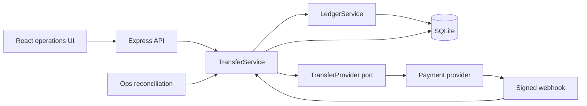

# RelayPay

RelayPay is a backend-heavy payments reference implementation built around one
question: how should a small money-moving system behave when requests race and
an external provider fails ambiguously?

The implementation prioritizes explicit financial invariants over feature
breadth. It combines database-backed idempotency, a double-entry ledger,
atomic balance reservations, authenticated provider callbacks, bounded
reconciliation, and an operations UI that makes uncertainty visible.

## Architecture



`TransferService` receives its database, provider, clock, and ledger through
constructor injection. Provider-specific request/response mapping therefore
lives behind the `TransferProvider` interface rather than inside the transfer
domain.

## Financial model

The append-only double-entry ledger is the financial source of truth.
`accounts.balance` is a fast available-balance projection.

Before withdrawal, RelayPay verifies that:

1. the caller owns the debit account;
2. every journal entry balances;
3. the user's ledger-derived available balance equals the projection;
4. the ledger-derived balance covers the requested amount.

The projection update, transfer record, and reservation journal entry commit in
one `BEGIN IMMEDIATE` transaction.

| Event | Debit | Credit |
| --- | --- | --- |
| Opening balance | RelayPay cash | User available |
| Reserve transfer | User available | Transfer payable |
| Capture transfer | Transfer payable | RelayPay cash |
| Release transfer | Transfer payable | User available |

SQLite triggers reject updates and deletes on journal entries and lines.

## Reliability guarantees

- `(owner_id, idempotency_key)` is unique and bound to a canonical request
  fingerprint.
- Concurrent duplicates cause one local reservation and at most one provider
  instruction.
- A missing provider response becomes `uncertain`, never falsely `failed`.
- Webhooks use exact-body HMAC-SHA256 verification and durable event
  deduplication.
- Guarded transfer and funds states make capture/release idempotent across
  callbacks and concurrent reconciliation workers.
- Provider reads have deadlines and reconciliation has bounded batch size and
  concurrency.
- Client retries preserve their intent key after network errors, 5xx responses,
  and `202 uncertain`.

These are local at-most-once and idempotent-financial-effect guarantees, not
distributed exactly-once. SQLite and the external provider do not share a
transaction. A transactional outbox plus provider-side client-reference
deduplication is the documented next production step toward effectively-once
execution.

## Run locally

Requirements: Node.js 22 or newer and npm.

```bash
npm install
npm test
npm run dev
```

- UI: [http://localhost:5173](http://localhost:5173)
- API: [http://localhost:3001](http://localhost:3001)
- Demo identities: `user-a`, `user-b`, and `ops-admin`, supplied through
  `x-demo-user`
- Money uses integer minor units: `125000` means ₦1,250.00

Useful verification commands:

```bash
npm run typecheck
npm test
npm run build
```

## Deterministic provider scenarios

The local provider makes failure behavior reproducible:

| Destination suffix | Provider behavior | Expected local result |
| --- | --- | --- |
| `99` | Immediate rejection | `failed`, reservation released |
| `88` | Accepted, response lost | `202 uncertain`, funds remain reserved |
| Anything else | Accepted | `pending`, then reconciliation settles it |

See [DEMO.md](./DEMO.md) for an interview-ready walkthrough.

## API surface

| Method and path | Purpose |
| --- | --- |
| `GET /api/health` | Service health |
| `GET /api/accounts` | Owner-scoped public account projections |
| `GET /api/accounts/integrity` | Owner-scoped ledger/projection verification |
| `GET /api/transfers?status=...` | Owner-scoped transfer history |
| `POST /api/transfers` | Idempotent transfer initiation |
| `POST /api/provider/webhook` | Signed provider outcome |
| `POST /api/admin/reconcile` | Bounded ops-only reconciliation |

## Operations UI

The React UI shows the available balance, ledger-integrity status, transfer
creation, loading/error states, status filters, lifecycle badges, and records
that require reconciliation.

## Evidence and design record

- [RISK_NOTES.md](./RISK_NOTES.md) ranks the baseline system's failure modes by broken
  invariant and financial impact.
- [DECISIONS.md](./DECISIONS.md) documents invariants, transaction boundaries,
  ledger postings, scaling, observability, limitations, authorship, and AI
  assistance.
- `tests/public` contains focused concurrency, retry, callback, reconciliation,
  ledger-integrity, and multi-instance tests.

## Deliberate limitations

- Header-based demo identity is not production authentication.
- SQLite is appropriate only for this local reference implementation.
- The full journal-balance scan is intentionally demonstration-scale.
- Reconciliation queries provider status but does not redrive a never-sent
  instruction.
- Provider-specific webhook verification would move behind an adapter before
  supporting multiple providers in production.

These boundaries are intentional: the project favors a small correct design
with explicit limitations over a broad unfinished platform.
